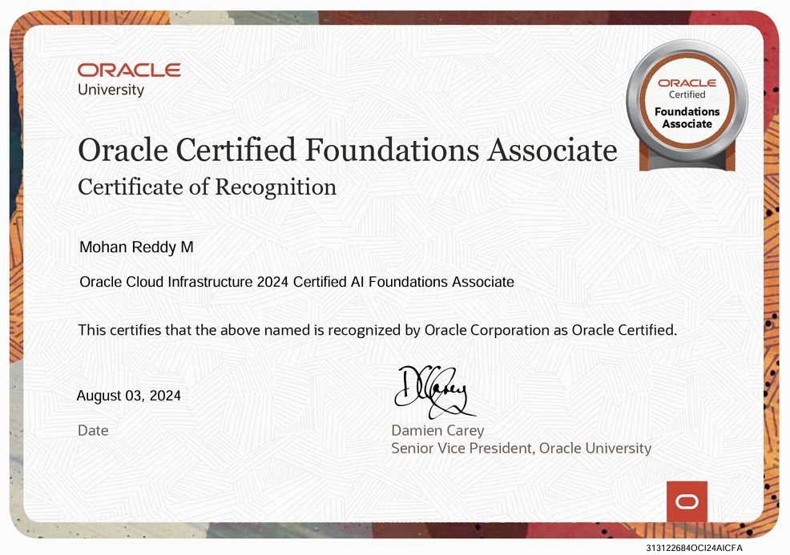

  <div align="center">

    <!-- Responsive Header Banner (1 File for Light/Dark Theme, Switches by Device Size) -->
    <a href="https://mohanreddy.me/">
      <picture>
        <source media="(max-width: 768px)" srcset="./public/banner-mobile.svg">
        <source media="(min-width: 769px)" srcset="./public/banner-laptop.svg">
        
      </picture>
    </a>

    <br/>

    <!-- Quick Action & Social Badges -->
    <p align="center">
      <a href="https://mohanreddy.me/">
        
      </a>
      <a href="https://www.linkedin.com/in/mmohanreddy/">
        
      </a>
      <a href="./public/mohan_resume_.pdf">
        
      </a>
      <a href="mailto:madhiremohanreddy@gmail.com">
        
      </a>
      <a href="https://github.com/ComradeMohan">
        
      </a>
    </p>

    <p align="center">
      <strong>Full Stack Developer • Software Engineer • Cyber Expert</strong>
      <br/>
      <em>Crafting resilient distributed systems, high-performance web applications, and intuitive cyber-aesthetic UIs.</em>
    </p>

  </div>

  ---

  ## ⚡ Featured Projects

  <div align="center">

    <!-- Responsive Featured Projects Showcase (SaveethaHub & UniVault in 1 SVG with Auto Light/Dark Switch) -->
    <a href="https://mohanreddy.me/">
      <picture>
        <source media="(max-width: 768px)" srcset="./public/featured-projects-mobile.svg">
        <source media="(min-width: 769px)" srcset="./public/featured-projects-laptop.svg">
        
      </picture>
    </a>

  </div>

  <br/>

  <div align="center">

    <h3>🚀 Engineering with Speed &amp; Precision</h3>

    <p align="center">
      Passionate about architecting cloud infrastructure, crafting pixel-perfect interfaces, and writing high-throughput backend services.
      <br/>
      Certified in <strong>Java SE 17</strong> &amp; <strong>Oracle Cloud Infrastructure</strong>.
    </p>

    <p align="center">
      <a href="https://mohanreddy.me/">
        
      </a>
    </p>

  </div>

  ---

  ## 🎯 Key Highlights & Architecture Metrics

  <div align="center">

  | Metric | Achievement | Details |
  | :---: | :---: | :--- |
  | 🚀 **Performance** | **99+ Lighthouse Score** | Zero CLS, optimized WebP pipelines, and responsive DOM rendering |
  | ☕ **Core Systems** | **Oracle Certified Professional** | Java SE 17 Developer certified with deep JVM, streams, and concurrency mastery |
  | 🛡️ **Cloud & Security** | **Oracle Cloud Infrastructure** | OCI Foundations Certified & robust full-stack cloud architecture practices |
  | ⚡ **Modern Frontend** | **Vite + React 18 + Tailwind** | Custom physics-based magnetic controls, Framer Motion blur reveals |
  | 🧪 **Testing & Quality** | **Playwright + Vitest** | Comprehensive end-to-end user journey test suites & unit verification |

  </div>

  ---

  ## 🛠️ Tech Stack & Capabilities

  <div align="center">

  ### 💻 Frontend & UI Engineering
  <p>
    
    
    
    
    
    
    
  </p>

  ### ⚙️ Backend & Architecture
  <p>
    
    
    
    
    
    
  </p>

  ### 🗄️ Databases & Cloud Infrastructure
  <p>
    
    
    
    
    
  </p>

  ### 🧪 DevOps, Testing & Tooling
  <p>
    
    
    
    
    
  </p>

  </div>

  ---

  ## 🏆 Research & Deep Dives

  <div align="center">

    <!-- Responsive Research Showcase (SaveethaHub & AI Detection in 1 SVG with Auto Light/Dark Switch) -->
    <a href="https://mohanreddy.me/">
      <picture>
        <source media="(max-width: 768px)" srcset="./public/research-deep-dives-mobile.svg">
        <source media="(min-width: 769px)" srcset="./public/research-deep-dives-laptop.svg">
        
      </picture>
    </a>

  </div>

  ---

  ## 🎖️ Verified Industry Certifications

  <div align="center">
    <table border="0" width="100%">
      <tr>
        <td width="33%" align="center" valign="top">
          
          <h4>Oracle Certified Professional</h4>
          <p><strong>Java SE 17 Developer</strong><br/>Enterprise application architecture, concurrent programming, and modular JVM systems.</p>
        </td>
        <td width="33%" align="center" valign="top">
          
          <h4>Oracle Cloud Infrastructure</h4>
          <p><strong>OCI Certified Associate</strong><br/>Cloud computing architecture, IAM, VCN networking, and storage solutions.</p>
        </td>
        <td width="33%" align="center" valign="top">
          
          <h4>JPMorgan Chase &amp; Co.</h4>
          <p><strong>Software Engineering</strong><br/>Financial systems development, interface optimization, and quantitative analytics.</p>
        </td>
      </tr>
    </table>
  </div>

  ---

  ## 🚀 Quick Setup & Local Development

  Run the portfolio locally on your machine in just a few steps:

  ```bash
  # 1. Clone the repository
  git clone https://github.com/ComradeMohan/ComradeMohan.github.io.git
  cd ComradeMohan.github.io

  # 2. Install dependencies
  npm install

  # 3. Start local development server
  npm run dev

  # 4. Run unit and end-to-end test suites
  npm test
  npm run test:e2e
  ```

  The application runs locally at `http://localhost:5173`.

  ---

  ## 📬 Let's Connect & Collaborate

  I am actively open to **Software Engineering Roles**, **Full-Stack Development**, and **High-Impact Projects**.

  <div align="center">

  <a href="https://mohanreddy.me/">
    
  </a>
  <a href="https://www.linkedin.com/in/mmohanreddy/">
    
  </a>
  <a href="mailto:madhiremohanreddy@gmail.com">
    
  </a>
  <a href="https://www.instagram.com/comrade_mohan666/">
    
  </a>

  <br/><br/>
  <!-- Bottom Activity Glow -->
  

  <br/>
  <sub>Designed and engineered with care by <strong>M Mohan Reddy</strong>. All rights reserved.</sub>

  </div>
